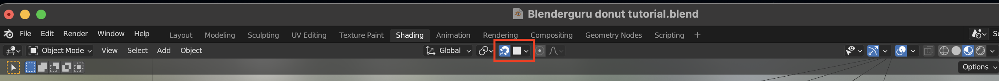

# Blender

- [Blender](#blender)
  - [Shortcuts](#shortcuts)
    - [Open preferences](#open-preferences)
    - [Move, scale, rotate, panning, hide](#move-scale-rotate-panning-hide)
    - [Select](#select)
    - [Duplicate](#duplicate)
    - [X-Ray mode](#x-ray-mode)
    - [Separating](#separating)
    - [Change view](#change-view)
    - [Change workspace](#change-workspace)
    - [Add objects](#add-objects)
    - [Edit mode(and other object modes)](#edit-modeand-other-object-modes)
    - [Extruding](#extruding)
    - [Sculpting](#sculpting)
    - [Areas](#areas)
  - [Knowledge](#knowledge)
    - [Modifiers](#modifiers)
      - [Subdivision surface modifier](#subdivision-surface-modifier)
      - [Solidify modifier](#solidify-modifier)
    - [Shade smooth \& shade flat](#shade-smooth--shade-flat)
    - [Proportional editing](#proportional-editing)
    - [Shrinkwrap modifier](#shrinkwrap-modifier)
    - [Snapping](#snapping)
    - [Rendering](#rendering)
      - [GPU rendering: Changing settigns to render on GPU](#gpu-rendering-changing-settigns-to-render-on-gpu)
      - [Viewport shading](#viewport-shading)
        - [Wireframe](#wireframe)
        - [Solid](#solid)
        - [Material preview](#material-preview)
        - [Rendered](#rendered)
      - [Eevee](#eevee)
        - [Improving Eevee rendering](#improving-eevee-rendering)
          - [Change shadow](#change-shadow)
          - [Ambient occlusion](#ambient-occlusion)
          - [Screen space reflections](#screen-space-reflections)
      - [Cycles](#cycles)
        - [Samples](#samples)
    - [Cameras](#cameras)
      - [Focal length/FOV](#focal-lengthfov)
      - [Depth of field](#depth-of-field)
      - [Sensor size](#sensor-size)
      - [Orthographic perspective](#orthographic-perspective)
      - [Camera view](#camera-view)
    - [Materials](#materials)
      - [Light scattering](#light-scattering)
    - [Shading/Texturing](#shadingtexturing)
      - [Noise texture](#noise-texture)
      - [Texture coordinate](#texture-coordinate)
        - [Creating a basic wave pattern](#creating-a-basic-wave-pattern)
      - [Image texture](#image-texture)
      - [UV Mapping](#uv-mapping)
  - [Geometry nodes](#geometry-nodes)
  - [Double PI](#double-pi)
  - [Weight painting](#weight-painting)
  - [Adding parent](#adding-parent)
  - [Keyframes](#keyframes)
  - [Animation pane](#animation-pane)
  - [Use frame value as input for geometry nodes](#use-frame-value-as-input-for-geometry-nodes)
  - [Creating frames for nodes](#creating-frames-for-nodes)
  - [Rendering on transparent by changing film to transparent](#rendering-on-transparent-by-changing-film-to-transparent)
  - [Render pass](#render-pass)
  - [Color grading with color balance](#color-grading-with-color-balance)
  - [Persistent data](#persistent-data)
  - [Improving render by playing with noise threshold, samples](#improving-render-by-playing-with-noise-threshold-samples)
  - [Changing clamping and caustics](#changing-clamping-and-caustics)
  - [F-stop](#f-stop)
  - [Openexr](#openexr)
  - [Opening a new blender file to stitch the renders together](#opening-a-new-blender-file-to-stitch-the-renders-together)
  - [Adding back colors](#adding-back-colors)

## Shortcuts

[Shortcut PDF from Blender Guru](Blender_3.0_Shortcuts_v1.2.pdf)

### Open preferences

| Shortcut    | Command          |
| ----------- | ---------------- |
| **CMD** + , | Open preferences |

### Move, scale, rotate, panning, hide

| Shortcut                              | Command                                   |
| ------------------------------------- | ----------------------------------------- |
| **G** (with object selected)          | Move object                               |
|                                       | press x,y,z to move along axis            |
|                                       | click middle mouse button to snap to axis |
| **S** (with object selected)          | Scale object                              |
|                                       | press x,y,z to scale along axis           |
| **R** (with object selected)          | Rotate object                             |
|                                       | press x,y,z to roate along axis           |
|                                       | click middle mouse button to snap to axis |
| **Shift** + middle mouse button       | Pan                                       |
| **option** + G                        | Snap object to center of scene            |
| H (with object selected)              | Hide object                               |
| **option** + H (with object selected) | Unhide object                             |

> Press `esc` or right click to cancel the command

> These commands are also used to modify meshes, vertices and so on

### Select

| Shortcut               | Command          |
| ---------------------- | ---------------- |
| **option** + **click** | Select edge loop |

### Duplicate

| Shortcut      | Command   |
| ------------- | --------- |
| **Shift** + D | duplicate |

### X-Ray mode

| Shortcut           | Command           |
| ------------------ | ----------------- |
| **Option/Alt** + Z | toggle X-Ray mode |

### Separating

| Shortcut | Command              |
| -------- | -------------------- |
| P        | open separation menu |

### Change view

| Shortcut                 | Command                     |
| ------------------------ | --------------------------- |
| **<** + 1                | camera                      |
| **<** + 2                | bottom                      |
| **<** + 3                | selected                    |
| **<** + 4                | left                        |
| **<** + 6                | right                       |
| **<** + 7                | front                       |
| **<** + 8                | top                         |
| **<** + 9                | back                        |
| middle mouse button      | orbit                       |
|                          | hold alt to snap to axis    |
| **option** + **CMD** + 0 | Align active camera to view |

### Change workspace

| Shortcut              | Command                  |
| --------------------- | ------------------------ |
| **control** + **Tab** | Open workspace selection |

### Add objects

| Shortcut      | Command       |
| ------------- | ------------- |
| **Shift** + A | open add menu |

> There is a panel to customize the added shape. If it has been closed, it can be restored by pressing **F9**

### [Edit mode(and other object modes)](https://docs.blender.org/manual/en/latest/editors/3dview/modes.html)

| Shortcut           | Command                        |
| ------------------ | ------------------------------ |
| Tab                | switch to edit mode            |
| **Control** + tab  | open mode selector             |
| O                  | switch to proportional editing |
| **option/alt** + S | shrink and fatten tool         |

### [Extruding](https://docs.blender.org/manual/en/latest/modeling/meshes/editing/mesh/extrude.html)

| Shortcut                           | Command                  |
| ---------------------------------- | ------------------------ |
| E(with vertices or faces selected) | extrude new vertice/face |

### [Sculpting](https://docs.blender.org/manual/en/latest/sculpt_paint/index.html)

- [Blender - Brush introduction](https://docs.blender.org/manual/en/latest/sculpt_paint/brush/introduction.html)

| Shortcut      | Command                            |
| ------------- | ---------------------------------- |
| G             | switch to grab brush               |
| F             | change radius size                 |
| **Shift** + F | change strength size               |
| Shift         | Switch to smooth brush temporarily |
| **Shift** + S | Switch to smooth brush             |
| **Shift** + I | Switch to inflate brush            |

### [Areas](https://docs.blender.org/manual/en/latest/interface/window_system/areas.html)

Windows inside blender are called areas.

> Place the cursor in the corner of an area to create a new area. E.g. to split the view.

## Knowledge

### [Modifiers](https://docs.blender.org/manual/en/latest/modeling/modifiers/index.html)

Modifiers are automatic operations that affect an object’s geometry in a non-destructive way.

#### [Subdivision surface modifier](https://docs.blender.org/manual/en/latest/modeling/modifiers/generate/subdivision_surface.html)

The Subdivision Surface modifier is used to split the faces of a mesh into smaller faces, giving it a smooth appearance.

> Keep the viewport subdivision low for better editing performance. Viewport subdivision surface modifier can also be turned off in blender.

#### [Solidify modifier](https://docs.blender.org/manual/en/latest/modeling/modifiers/generate/solidify.html)

The Solidify modifier takes the surface of any mesh and adds depth, thickness to it.

### [Shade smooth & shade flat](https://docs.blender.org/manual/en/latest/modeling/meshes/editing/face/shading.html)

The shading of an object can be change by **right-clicking**. When using "shade-smooth", the meshes are not rendered individually, making the object appear more smooth. When using "shade-flat", individual meshes are visible.

### [Proportional editing](https://docs.blender.org/manual/en/latest/editors/3dview/controls/proportional_editing.html)

Proportional editing is done in edit mode and can be turned on with **O**. When selecting a vertice, vertices around it are also selected. E.g. when moving a single vertice, the vertice around move in the same direction proportionally.

> Change the proportional size by **scrolling up**

### [Shrinkwrap modifier](https://docs.blender.org/manual/en/latest/modeling/modifiers/deform/shrinkwrap.html)

The Shrinkwrap modifier allows an object to “shrink” to the surface of another object. It moves each vertex of the object being modified to the closest position on the surface of the given mesh (using one of the four methods available).

> E.g. for a donut, this enables us to wrap the icing around the donut.

### [Snapping](https://docs.blender.org/manual/en/latest/editors/3dview/controls/snapping.html)

Snapping lets you easily align objects and mesh elements to others. It can be toggled by clicking the magnet icon in the 3D Viewport’s header, or more temporarily by holding `ctrl`.

> If snapping is enabled, a vertice might not move and cause confusion, keep this in mind to check if snapping is enabled.

### [Rendering]()

#### [GPU rendering](https://docs.blender.org/manual/en/latest/render/cycles/gpu_rendering.html): Changing settigns to render on GPU

Use GPU for Cycles: **Preferences** -> **System** -> Switch Cycles Render Devices to use **Metal**(on Mac).

In **scene settings**, change the device to **GPU compute**.

#### [Viewport shading](https://docs.blender.org/manual/en/latest/editors/3dview/display/shading.html)

##### Wireframe

Only displays the edges (wireframes) of the objects in the scene.

##### Solid

It shows solid geometry but uses simplified shading and lighting without the use of shader nodes. Solid mode is good for modeling and sculpting, and is really useful with the multitude of options to emphasize certain geometric features.

##### Material preview

This mode is particularly suited for previewing materials and painting textures. You can select different lighting conditions to test your materials.

> Change settings to use scene lights and scene world

##### Rendered

Render the 3D Viewport using the scene’s Render Engine, for interactive rendering. This gives you a preview of the final result, including scene lighting effects.

#### [Eevee](https://docs.blender.org/manual/en/latest/render/eevee/index.html)

Eevee is the built-in realtime render engine which focuses on speed and interactivity.

Unlike Cycles, Eevee is not a raytrace render engine. Instead of computing each ray of light, Eevee uses a process called rasterization. Therefore Cycles will provide more physically accurate renders.

##### Improving Eevee rendering

Eevee rendering can be improved by applied various techniques listed below.

###### Change shadow

> Change cube size to improve shadow resolution
>
> 

> Select light -> Light settings -> Shadow -> Reduce/increase bias according to size of object
>
> 

###### Ambient occlusion

Turn on ambient occlusion to improve dark parts of image and achieve more realistic result.

###### Screen space reflections

To get reflections, turn on scren space reflection.

#### [Cycles](https://docs.blender.org/manual/en/latest/render/cycles/index.html)

##### Samples

Reduce samples to increase render time based on the size of the object. To counter the effect of less samples, denoising can be activated. Denoising will slow the render duration, to make it more performant, the start sample can be changed.

TODO: adaptive sampling

### [Cameras](https://docs.blender.org/manual/en/latest/render/cameras.html)

#### Focal length/FOV

The Focal Length controls the amount of zoom, i.e. the amount of the scene which is visible all at once. Longer focal lengths result in a smaller FOV (more zoom), while short focal lengths allow you to see more of the scene at once (larger FOV, less zoom).

#### Depth of field

Focus an object to determine the focal point. If no object is focussed, define the focal distance.

#### Sensor size

#### Orthographic perspective

Objects appear at their actual size, regardless of distance. Lines will be parallel.

#### [Camera view](https://docs.blender.org/manual/en/latest/editors/3dview/navigate/camera_view.html)

Camera view shows the current scene from the active camera's viewpoint.

### Materials

To create a basic material, change the color and adjust the roughness.

#### Light scattering

To add scattering, add subsurface and and change subsurface radius and color.

### [Shading/Texturing](https://docs.blender.org/manual/en/latest/render/shader_nodes/textures/index.html)

Texturing adds texture to objects. Texturing is achieved with shaders. The most common shader is the [Principled BSDF](https://docs.blender.org/manual/en/latest/render/shader_nodes/shader/principled.html) shader. The Principled BSDF that combines multiple layers into a single easy to use node. It is based on the Disney principled model also known as the “PBR”(See: [Physically based rendering](../physicallybasedrendering)).

#### Noise texture

> Use a **noise texture** combined with a **color ramp** to create color variation. This can further be combined with a **bump** so that the bump can be connected to the **normal of the Shader**(E.g. Principaled BSDF) Add **texture coordinate** to **Vector input** of noise texture to change the mapping.

#### [Texture coordinate](https://docs.blender.org/manual/en/latest/render/shader_nodes/input/texture_coordinate.html)

Texture coordinates can be used in several ways and help with mapping procedural textures on objects.

##### Creating a basic wave pattern

1. Go to shading workspace
2. Add [texture coordinate](#texture-coordinate)
3. Create a **Separate XYZ** node and connect the **UV** from **Texture coordinate** to **Vector** of Separate XYZ.
   - This allows us to access the coordinates from **Texure coordinate** separately. E.g. the coordinate X
   - See: [UV Mapping](#uv-mapping)
4. The **X coordinate** then can be used as **Vector** input for a **Math converter** of type **Sine** to create a wave, based on the X coordinate.
5. To get greater or less variation, add another **Math converter** of type **Multiply** to multiply the X coordinate by a factor. This node has to be between **Separate XYZ** and **Sine**
6. **Sine** will give us a value between -1 and 1 which will result in all values below 0 to be treated as 0 when converting the **Sine** output value to color.
   1. Therefore, we need to map the output value from **Sine** from the range(-1 to 1) to the range (0,1) whch can be achiever with the **Map Range converter**.
7. Connect the output of the **Map Range converter** to the **Base color** of the shader which will give us the wave pattern.

#### Image texture

Create a new **image texture** in the node editor. The texture then can be edit in the **texture paint workspace**.
The settings of texture drawing, open the **active tool** tab in the properties panel/window.

> Keep the resolution as low as possible to save render time.

#### UV Mapping

The UV mapping defines how a texture is mapped to a object. For this to work, the faces of an object are unwrapped onto a square. This can be changed in several ways by using the UV menu.

E.g. a cube is by default unwrapped in the following way:

## Geometry nodes

TODO: Add setup of donut geometry nodes
TODO: Add tutorial on how to create plants with geometry nodes
TODO: Add tutorial on how to create grid

## Combining colors with Mix

TODO: Add how to achieve the different colored sprinkles using Mix Node

## Double PI

## Weight painting

TODO: explain donut weight painting for density of sprinkles

## Adding parent

TODO: Show how adding an object as a parent of an object

## Keyframes

TODO: Show how keyframing works and how to adjust the easing

## Animation pane

## Use frame value as input for geometry nodes

## Creating frames for nodes

bpy.context.scene.frame_end

## Lighting

## Changing color managemengt settings

TODO: change look to high contrast
TODO: change view transform to false color and change exposure

TODO: spot problem by rendering first/last/middle frame

## Rendering on transparent by changing film to transparent

## Compositing

ctrl shift click -> focus on node

## Render pass

## Color grading with color balance

## Persistent data

## Improving render by playing with noise threshold, samples

## Adding motion blur

## Setting max bounces for light paths

## Changing clamping and caustics

## Todo EVEE render settings for rendering

## F-stop

## Openexr

## Opening a new blender file to stitch the renders together

## Adding back colors