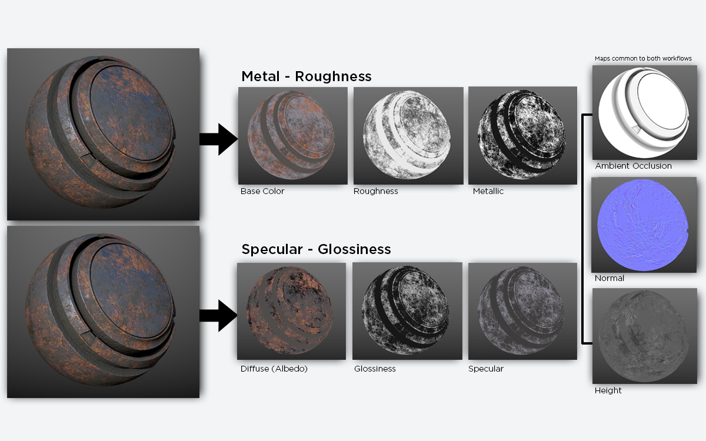

# Materials with physically based rendering(PBR)

- [Materials with physically based rendering(PBR)](#materials-with-physically-based-renderingpbr)
  - [What is physically based rendering?](#what-is-physically-based-rendering)
    - [Resources](#resources)
  - [Light rays](#light-rays)
    - [Reflection](#reflection)
    - [Refraction](#refraction)
    - [Absorption](#absorption)
    - [Scattering](#scattering)
  - [Microfacet Model](#microfacet-model)
  - [Energy Conservation](#energy-conservation)
  - [Fresnel Effect](#fresnel-effect)
  - [PBR Workflows](#pbr-workflows)
    - [Metal - Rougness](#metal---rougness)
    - [Specular - Glossiness](#specular---glossiness)
  - [Texture maps](#texture-maps)
    - [Albedo](#albedo)
    - [Specular Reflection](#specular-reflection)
    - [Normal](#normal)
    - [Metalness](#metalness)
    - [Roughness](#roughness)
    - [Glossiness](#glossiness)
    - [Ambient occlusion](#ambient-occlusion)
    - [Height](#height)

## What is physically based rendering?

Physically based rendering/shading is a technique used in 3D computer graphics to achieve more realistic lighting and material appearances.

### Resources
- [learnopengl.com - PBR Theory](https://learnopengl.com/PBR/Theory)
- [adobe.com - PBR](https://www.adobe.com/products/substance3d/discover/pbr.html)
- [chaos.com - What is PBR rendering](https://www.chaos.com/blog/what-is-pbr-physically-based-rendering-a-complete-guide)
- [marmoset.co - Basic theory of physically based rendering](https://marmoset.co/posts/basic-theory-of-physically-based-rendering/)
- [marmoset.co - Phyiscally based rendering and you can too](https://marmoset.co/posts/physically-based-rendering-and-you-can-too/)
- [a23d.co - Difference between albedo and diffuse map](https://www.a23d.co/blog/difference-between-albedo-and-diffuse-map)
- [adobe.com - What is normal mapping?](https://www.adobe.com/products/substance3d/discover/normal-mapping.html)
- [The PBR Guide](the-pbr-guide.pdf)

## Light rays

Light travels in straight lines called rays. When a light ray hits a surface, it can either bounce off(reflection) or pass through(refraction).

### Reflection

When a light is reflected, the angle it hits the surface(angle of incidence) is equal to the angle it bounces off(angle of reflection).

### Refraction

When light passes from one material to another(e.g. from air to water), it changes direction and speed. This is called refraction.

### Absorption

Light can be absorbed by materials, whcih describes that the light intensity is decreased and turned into another form of energy, most likely heat.

### Scattering

When light is scattered, the direction of the light rays changes depending on the material. Scattering does not change the intensity.

## Microfacet Model
This is a model that represents the surface as a collection of tiny facets.
It helps in calculating how light interacts with rough surfaces, affecting both diffuse and specular reflection.

## Energy Conservation
Energy conservation describes that the total amount of light reflected and scatterd back by a surface must by less than the amount of light that hits it.
This ensures that objects do not appear unnaturally bright or dark and maintain realistic light interaction.

## Fresnel Effect
This effect describes how the amount of reflected light changes depending on the viewing angle. It makes surfaces appear more reflective at grazing angles, like how a road looks wet and reflective when viewed from a distance.

## PBR Workflows
There are two types of PBR workflows, which are described below. They differ in the approach they take regarding reflective materials.

### Metal - Rougness
For the metal/roughness worflow, we use a set of textures:
- Base color
- Metallic
- Roughness
- Ambient occlusion
- Normal
- Height

In the metal/roughness workflow, the reflectance value for metals is placed in the base color map along with the reflected color for dielectrics. A metallic map is used, which works like a mask to differentiate metal and dielectric data found in the base color map.

### Specular - Glossiness
For the specular/glossiness worflow, we use a set of textures:
- Diffuse
- Specular
- Glossiness
- Ambient occlusion
- Normal
- Height

With the specular/glossiness workflow, you have two RGB maps: one for diffuse color (albedo) and another for reflectance values (specular)

## Texture maps

### Albedo
Albedo is the basic color of a material which influences the overall appearance of a material, before any lighting or shading is applied. The albedo map defines the diffuse color of an object, which is the color that it would appear to have in bright, evenly-distributed light. The albedo map uses RGB colors.

> Also referred to as **diffuse color**

### Specular Reflection
Specular reflection is the light that is reflected at the surface and then travels to a different reflection, following the law of reflection.
The specular map defines the reflectance values for metal and the F0 for non-metal.

### Normal

The normal map stores information of surface detail, without changing the geometry below (it does not increase the amount of polygons). With normal information, we can add detail like bumps, scratches and more.

It is an RGB map where each component corresponds to the X, Y and Z coordinates of the surface normal.

> Also referred to as **bump map**

### Metalness
The metallic map is used to define which areas of a material denote raw metal. As a grayscale map, it operates in a manner similar to a mask, as it tells the shader how it should interpret data found in the base color.
Defines the metallic properties of a material, influencing the reflectivity.
Metallic surfaces reflect all incident light as specular, while non-metallic surfaces reflect light as both specular and diffuse.

### Roughness
The roughness map describes the surface irregularities that cause light diffusion. This controls how rough or smooth a surface is. A smoother surface leads to sharper, clearer reflections, while a rougher surface scatters light, leading to duller reflections.

The roughness map is the most creative map as it allows the artist to visually define the character of a surface. It allows you to creatively tell a story about the condition of a surface. What is its environment? Has it been handled with care or disregard? Has it been exposed to the elements?

### Glossiness

The glossiness map describes the surface irregularities that cause light diffusion. It is the inverse of the roughness map in the metal/roughness workflow.

### Ambient occlusion

The ambient occlusion map defines how much of the ambient environment lighting is accessible to a surface point.

### Height
A height map is often used for displacement in rendering.

The height map should be designed to represent the overall silhouette of the forms used to displace the geometry. A good practice is to use a blurred version of the height to bring out the forms and reduce any high-frequency details. This will cause the normal map to provide the high-frequency details, and the height will displace the silhouette of the forms