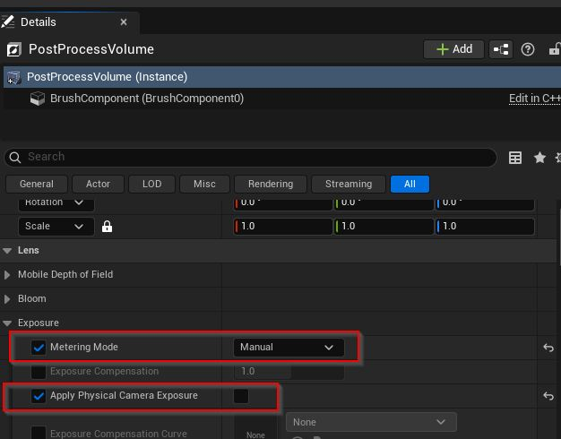

# Lighting

- [Lighting](#lighting)
  - [Lumen](#lumen)
    - [Settings for optimizing reflections](#settings-for-optimizing-reflections)
  - [Sky Light](#sky-light)
  - [Volumetric Cloud](#volumetric-cloud)
  - [Use env. light mixer](#use-env-light-mixer)
  - [Disable Auto-Exposure](#disable-auto-exposure)
  - [Adjusting god rays](#adjusting-god-rays)
  - [Adjusting hard and soft shadows](#adjusting-hard-and-soft-shadows)
  - [Improving light flickering](#improving-light-flickering)

## Lumen

Lumen is the illumination and reflection system of Unreal Engine.

> Official documentation: [epicgames.com - Lumen Global Illumination and Reflections in Unreal Engine](https://dev.epicgames.com/documentation/en-us/unreal-engine/lumen-global-illumination-and-reflections-in-unreal-engine)

### Settings for optimizing reflections

## Sky Light

> Official documentation: [epicgames.com - Sky Lights in Unreal Engine](https://dev.epicgames.com/documentation/en-us/unreal-engine/sky-lights-in-unreal-engine)

HDRIs can be applied using the sky light. To do so, change the source type to "SLS Specificed Cubemap" and set the cubemap to the HDRI.

To create a texture cube automatically, make sure that the HDRI is a ".hdr" file.

To disable a sky light, uncheck "Affects World" in the details panel.

Movable sky lights update when either "Real Time Capture" is enabled or "Recapture" is triggered.

When the ground is blocking the sky, it makes sense to set "Lower Hemisphere Is Solid Color".

The "Sky Distance Threshold" defines what to capture relative to where it is located. If the value is small, the objects surrounding the sky light will be captured. If it is high, the objects within the threshold distance of the sky light will be ignored.

## Volumetric Cloud

> Official documentation: [epicgames.com - Volumetric Cloud Component in Unreal Engine](https://dev.epicgames.com/documentation/en-us/unreal-engine/volumetric-cloud-component-in-unreal-engine)

With the volumentric cloud component, clouds can be created physically-based. It is combined with sky atmosphere and sky light using real time capture.

When not working with games but instead trying to achieve cinematic quality, the following section is really helpful [epicgames.com - Achieving Cinematic Quality](https://dev.epicgames.com/documentation/en-us/unreal-engine/volumetric-cloud-component-in-unreal-engine#achievingcinematicquality)

## Use env. light mixer
To easily add lights, use the env. light mixer by choosing `Window` -> `Env. light mixer` and then add the needed lights.

> Official documentation: [epicgames.com - Environment light mixer in Unreal Engine](https://dev.epicgames.com/documentation/en-us/unreal-engine/environment-light-mixer-in-unreal-engine)

## Disable Auto-Exposure

Unreal Engine does automatically adjust the exposure, to disable this behaviour, follow these steps:

- Add `Post Process Volume`, if desired, set the `Infinite Extent (Unbound)` to `true`, so it affects the whole level
- Change `Metering Mode` to `Manual`
- Change `Apply Physical Camera Exposure` to `false`

After doing this, we can manually adjust the `Exposure Compensation`.

## Adjusting god rays

To have visible god rays, we can tweak a few settings.

- In the `Exponential Height Fog`, change the `Volumetric Fog` to `true`
- In the `Directional Light` for e.g. the sun, change the `Volumetric Scattering Intensity` to the desired value

> The look and feel of the god rays can be further adjusted by changing the `Scattering Distribution` of the `Exponential Height Fog`.

## Adjusting hard and soft shadows

The hardness or softness of shadows is dependent on the size of the light. To make a shadow softer, increase the `Source Radius` to the desired size.

## Improving light flickering

Sometimes there is light flickering happening, which can be improved by following these steps:

- Go to `Post Process Volume`
- Adjust `Lumen Scene Lighting Quality`, probably increasing it
- Adjust `Final Gather Quality`, probably increasing it
- Adjust `Final Gather Lighting Speed Update`, probably decreasing it