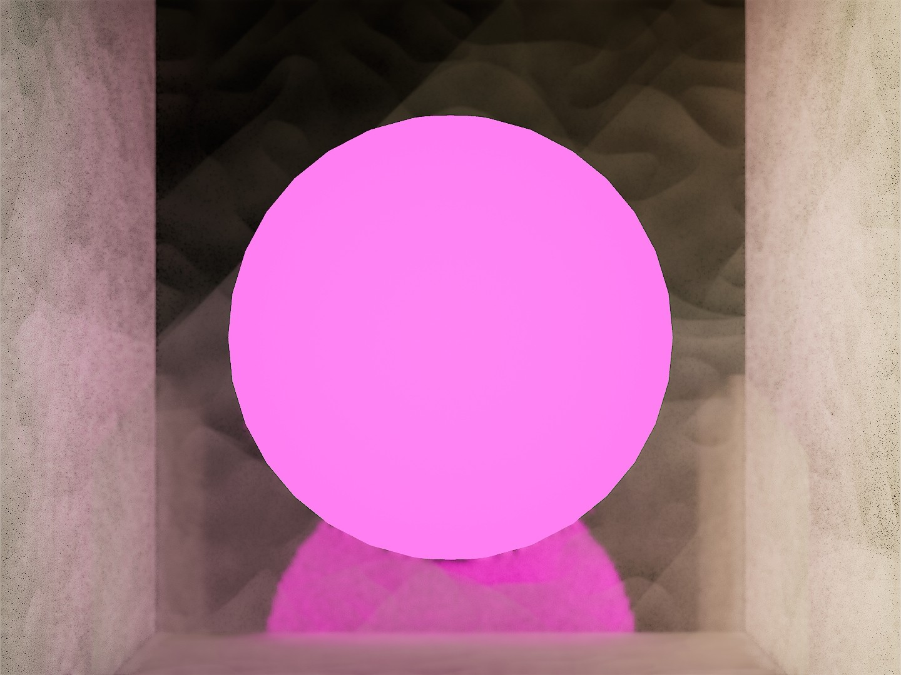
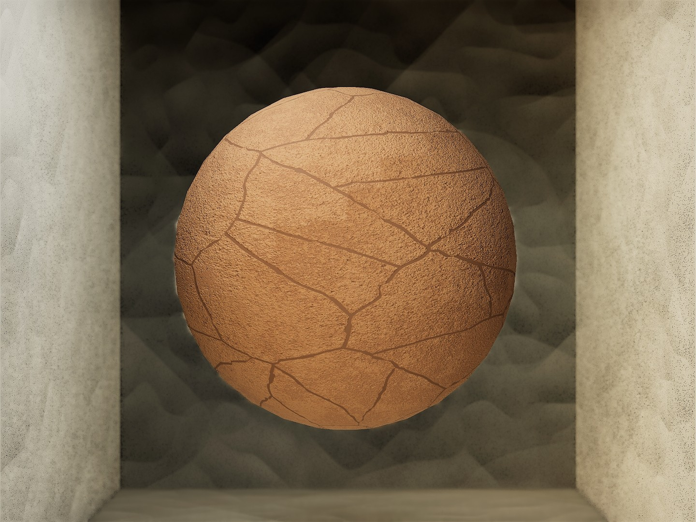
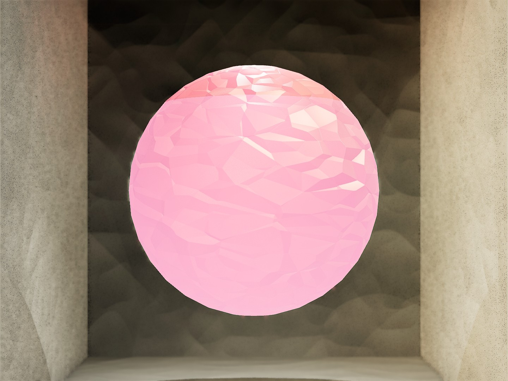
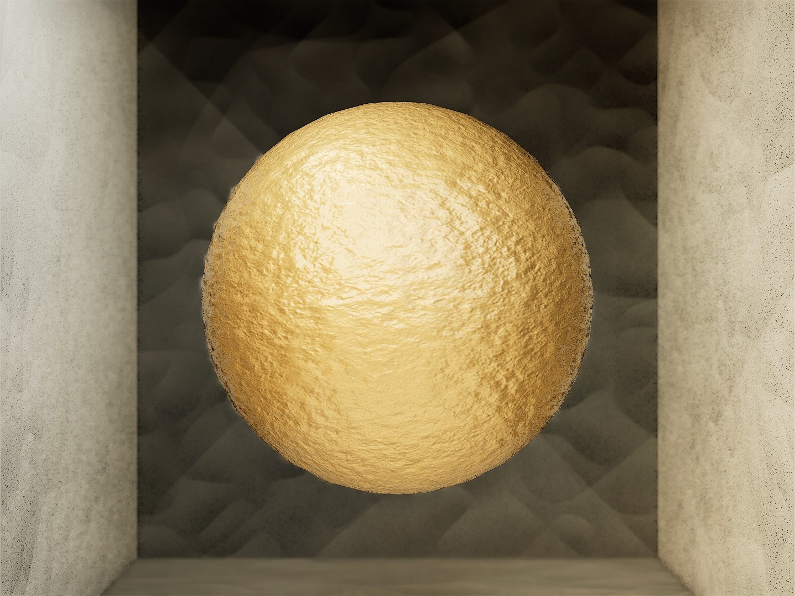
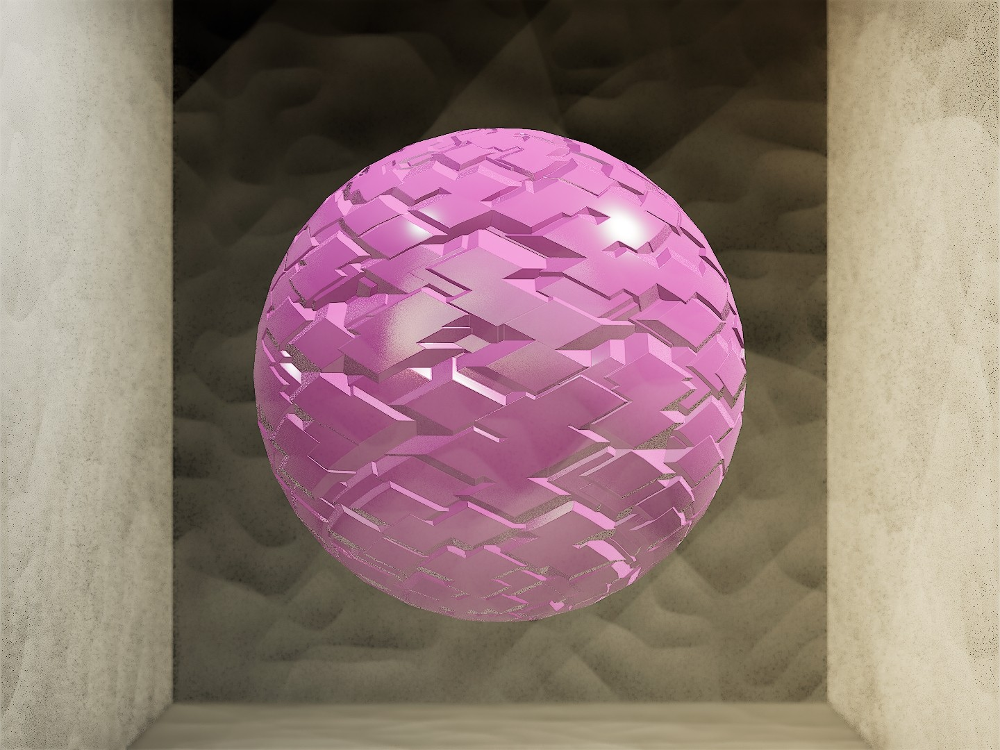
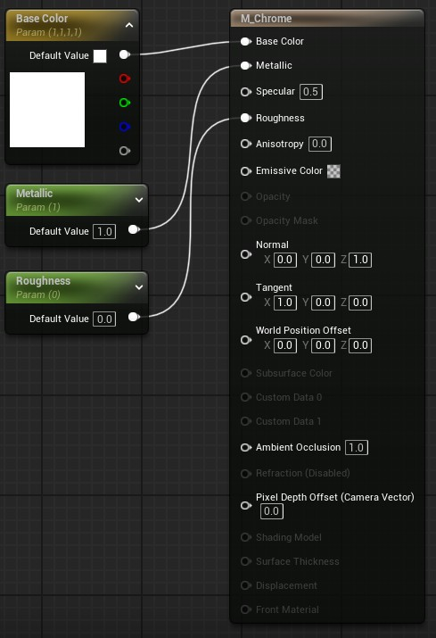
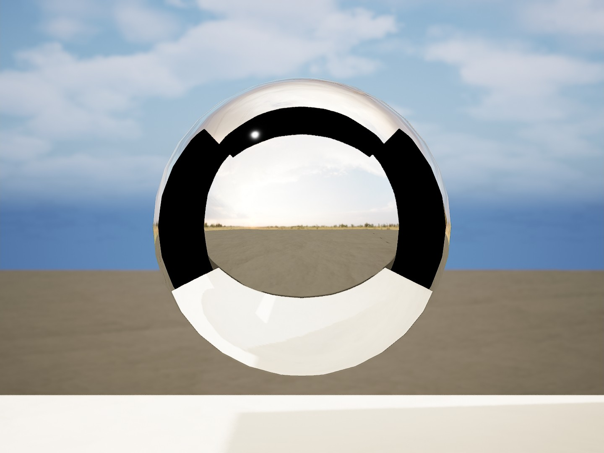
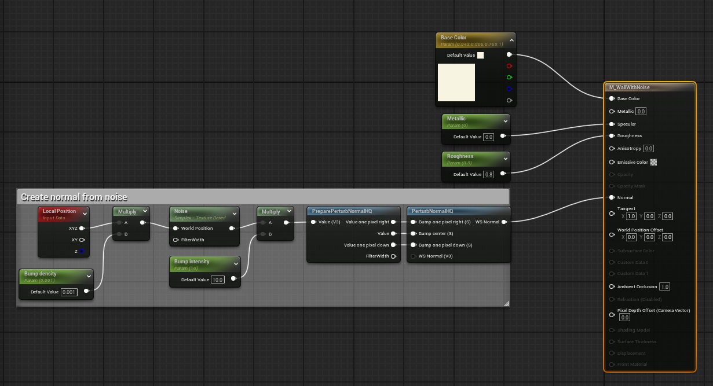

# Materials

- [Materials](#materials)
  - [Shading models](#shading-models)
    - [Unlit](#unlit)
      - [Example](#example)
    - [Default Lit](#default-lit)
      - [Example](#example-1)
    - [Subsurface](#subsurface)
      - [Example](#example-2)
    - [Clear coat](#clear-coat)
      - [Example](#example-3)
    - [Thin translucent](#thin-translucent)
      - [Example](#example-4)
  - [Material examples](#material-examples)
    - [Creating a chrome material](#creating-a-chrome-material)
      - [Configuration](#configuration)
      - [Result](#result)
    - [Creating a material using metal - roughness workflow](#creating-a-material-using-metal---roughness-workflow)
    - [Creating a material using specular - glossiness workflow](#creating-a-material-using-specular---glossiness-workflow)
    - [Creating a material with normal map from noise](#creating-a-material-with-normal-map-from-noise)

## Shading models

Shading models control how incoming light is reflected by the material. The `Default Lit` is the general purpose shading models mostly used.

> See: [epicgames.com - Shading Models in Unreal Engine](https://dev.epicgames.com/documentation/en-us/unreal-engine/shading-models-in-unreal-engine)

### Unlit

The `Unlit` shading model outputs emissive color and results in a glow effect. It does not illuminate or cast shadows.

#### Example

### Default Lit

The `Default Lit` shading model uses direct and indirect lighting and specularity for reflections.

#### Example

### Subsurface

The `Subsurface` shading model is used when subsurface scattering is necessary meaning that light penetrates the surface and then diffuses through it. E.g. ice or skin

> See: [epicgames.com - Subsurface Shading Model in Unreal Engine](https://dev.epicgames.com/documentation/en-us/unreal-engine/subsurface-shading-model-in-unreal-engine)

#### Example

### Clear coat

The `Clear coat` shading model has a thin translucent layer over the standard material

#### Example

### Thin translucent

The `Thin translucent` shading model is for translucent material like tintend or colored glass.

#### Example

## Material examples

### Creating a chrome material

- Set color to white
- Set roughness to 0
- Set metallic to 1

#### Configuration

#### Result

### Creating a material using metal - roughness workflow

### Creating a material using specular - glossiness workflow

### Creating a material with normal map from noise

