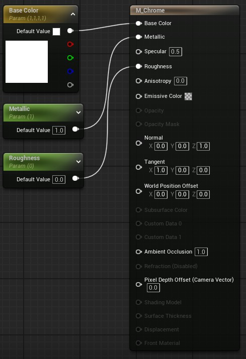

# Materials

## Creating a chrome material

- Set color to white
- Set roughness to 0
- Set metallic to 1

## Creating a material using metal - roughness workflow

## Creating a material using specular - glossiness workflow