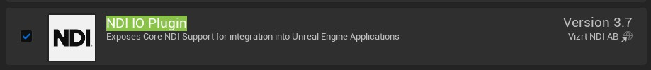
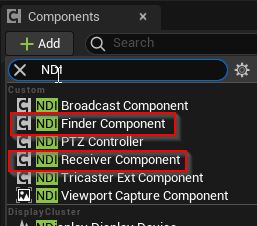
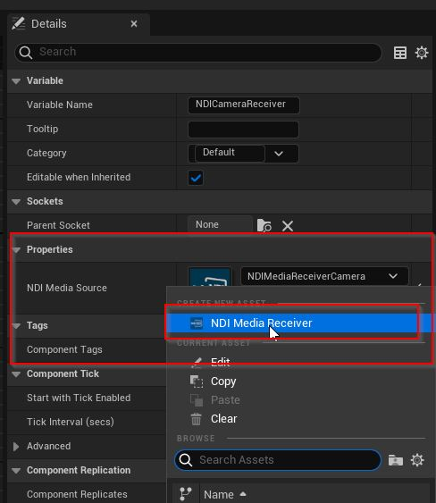
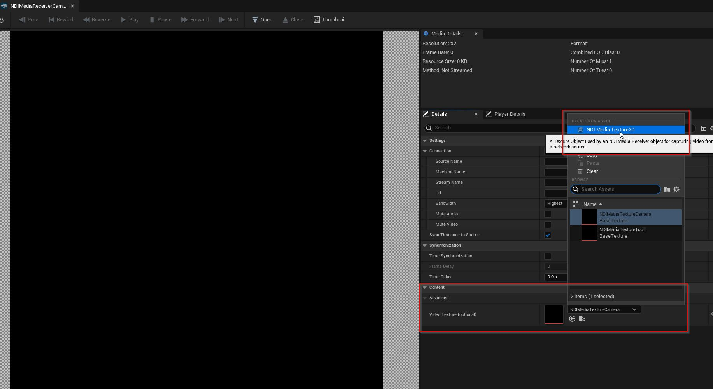
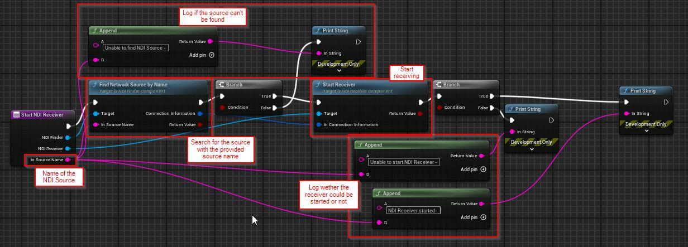

# Virtual Production

- [Virtual Production](#virtual-production)
  - [Using NDI sources](#using-ndi-sources)
    - [Prerequisites](#prerequisites)
      - [Install NDI Unreal Engine SDK](#install-ndi-unreal-engine-sdk)
      - [Enable NDI IO Plugin](#enable-ndi-io-plugin)
    - [Blueprint setup for NDI receiver](#blueprint-setup-for-ndi-receiver)

## Using NDI sources

Using NDI sources in Unreal Engine is rather simple and can be achieved with a blueprint.

### Prerequisites

#### Install NDI Unreal Engine SDK
Install the [ndi.video - NDI Unreal Engine SDK](https://ndi.video/for-developers/ndi-unreal-engine-sdk/) and make sure to use the Unreal Engine version supported by the SDK.

#### Enable NDI IO Plugin
Make sure to enable the NDI IO Plugin for the project.

### Blueprint setup for NDI receiver

In order to stream from NDI, we need to set up a few things. First, we need to create a new blueprint. In this blueprint we need to add a `NDI Finder` to find sources and get their connection information and we need a `NDI Receiver` which will receive the media from the source.

Once we have added the receiver, we need to provide a `Media Source`. So we create a new `NDI Media Receiver`.

Then we need to open the newly created Media Receiver and create a new `NDI Media Texture 2D`.

The content of the NDI source will then be streamed to this texture. This will not happen automatically, we still need to set up some logic inside the blueprint.

A simple setup would look like this:

In this setup, we have a variable `In Source Name` which would be the name of the NDI source, which is a combination of `Machine Name` and `Source Name` in the following format `{Machine Name} ({Source Name})`. E.g. `BF1580164 (Tooll3)`.

The we call the function `Find Network Source by Name` of the `NDI Finder` component with this source name. As a result we get the connection information from this source which we pass on to the function `Start Receiver` of the `NDI Receiver`.

To get feedback on our function calls, we can add `Branch` and log out messages if something has failed.