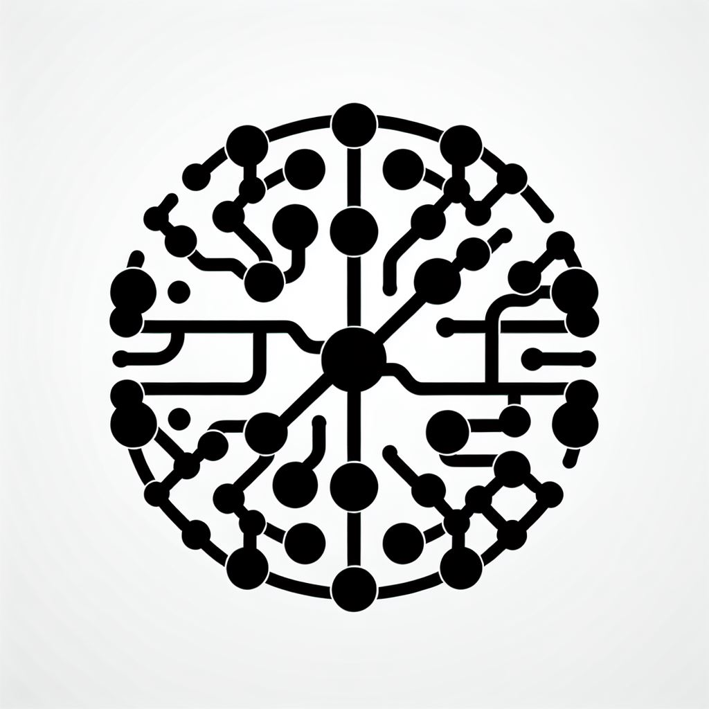

# Help

[Back to overview](/studiesstart/)

| Icon                                                 | Category              | Resources                                                                                                                                                                                                                                                                                        |
| ---------------------------------------------------- | --------------------- | ------------------------------------------------------------------------------------------------------------------------------------------------------------------------------------------------------------------------------------------------------------------------------------------------ |
|               | **3D**                | [3d](3d) [Blender](3d/blender) [Unity](unity) [Physically based rendering](3d/physicallybasedrendering)                                                                                                                                                                                 |
|    | Accessibility         | [Accessibility](accessibility)                                                                                                                                                                                                                                                                   |
|        | Animation             | [Animation](animation)                                                                                                                                                                                                                                                                           |
|   | App development       | [App development](appdevelopment)                                                                                                                                                                                                                                                                |
|            | Audio                 | [Tidal cycles](tidalcycles)                                                                                                                                                                                                                                                                      |
|   | Creative coding       | [p5](p5js) [Graphic libraries](graphiclibraries) [TouchDesigner](touchdesigner) [Noise](noise)                                                                                                                                                                                          |
|           | Colors                | [Colors](colors)                                                                                                                                                                                                                                                                                 |
|              | CSS                   | [CSS](css)                                                                                                                                                                                                                                                                                       |
|                                                      | Design principles     | [Design principles](designprinciples)                                                                                                                                                                                                                                                            |
|          | Drawing               | [Drawing](drawing)                                                                                                                                                                                                                                                                               |
|                                                      | Interface design      | [Eight golden rules of interface design](https://capian.co/shneiderman-eight-golden-rules-interface-design) [Designing interfaces](https://www.oreilly.com/library/view/designing-interfaces-3rd/9781492051954/) [Material design components reference](https://m3.material.io/components) |
|                                                      | Javascript            | [threeJS - 3D web library](threejs) [Nuxt - Vue application framework](nuxt) [p5 - Creative graphic library](p5js) [WebAssembly](webassembly) [JavaScript](javascript) [rete.js - Node editor framework](retejs)                                                                  |
|              | Large language models | [LLM](llm)                                                                                                                                                                                                                                                                                       |
|  | Machine learning      | [MediaPipe](mediapipe)                                                                                                                                                                                                                                                                           |
|               | OS                    | [macOS](macos)                                                                                                                                                                                                                                                                                   |
|      | Social Media          | [Social media](socialmedia)                                                                                                                                                                                                                                                                      |
|            | Tools                 | [Visual Studio Code](vscode) [GitHub Pages](githubpages)                                                                                                                                                                                                                                      |
|       | Typography            | [Typography](typography)                                                                                                                                                                                                                                                                         |
|     | UI frameworks         | [Graphic libraries](graphiclibraries)                                                                                                                                                                                                                                                            |