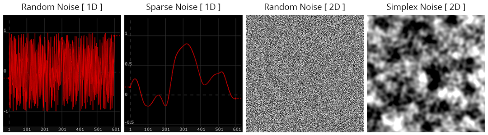

# Noise

Noise means different things in different contexts. For instance, in communication systems noise is the unwanted disturbance of a signal. It is the static of an old television, or the hiss and pop of a record, or the high pitched whine of electromagnetic interference when walking through library security scanners while wearing headphones. Within the practice of sound art and video art many practitioners intentionally incorporate noise into their work, recontextualizing unwanted or unpleasant signals. This idea is present in a plethora of artistic mediums and movements: from musique concrète, to harsh noise music, to hardware hacking and contemporary glitch art. So often noise provides a fresh perspective that can surprise and inspire you as the artist.

It’s important to make a distinction between analog noise, and its digital counterpart. Given the same initial conditions, a program is expected to behave the same way every time. The predictability of software is a double-edged sword: what is great for a developing a consistent user interface is also what makes it challenging to intentionally create the unexpected. One way to start engineering randomness is with noise, which in this case refers to pseudorandom patterns of numbers. Pseudorandom because computer algorithms are inherently deterministic and cannot provide randomness in the way specialized hardware can sample physical processes to produce “true” random numbers. The next best thing is to use functions which provide sequences of numbers that approximate randomness. Such noise functions provide a variety of interesting and useful patterns that seemingly never repeat (though ultimately they do).

A sequence of random noise will typically be discontinuous, where adjacent values jump around and have no apparent connection to the previous (as illustrated by the two examples of random noise below). This can be desirable, for instance, when each sample needs to effect a separate object. On the other hand, often one wants randomness with smooth transitions between points. There are several noise variants that accomplish this, with the more common examples being Perlin and Simplex noise, both of which were developed by Ken Perlin in the 1980’s.

> For more information on noise check out The Book of Shaders articles on [Randomness](https://thebookofshaders.com/10/)

Noise is an important tool for creating digital generative art. For a work to be generative, there must be autonomous (or non-human) systems involved in the decision making process. To that end, generative art need not be digital. Artists have long incorporated randomness in their work. In the 1950’s [Ellsworth Kelly](https://azprojectsblog.wordpress.com/2015/09/27/the-aesthetics-of-chance-ellsworth-kelly/) used chance operations to determine color choices in his paintings, while John Cage and Merce Cunningham are known for using chance (such as [consulting the I Ching](https://www.wfmt.com/2017/02/24/composer-john-cage-choreographer-merce-cunningham-changed-art-collaboration/)) to make choices in music composition and choreography. In the digital domain, noise can be a coin flip, or it can move smoothly like the path that a leaf takes as it falls from a tree (like the continuous curves generated using sparse noise in TouchDesigner).

> Read further: [Anders Hoff’s (Inconvergent)](https://inconvergent.net/2016/shepherding-random-numbers/) and Jason Bailey’s article [Why Love Generative Art?](https://www.artnome.com/news/2018/8/8/why-love-generative-art) 

[Source - simonaa.media](https://www.simonaa.media/tutorials/noisedisplacement)

