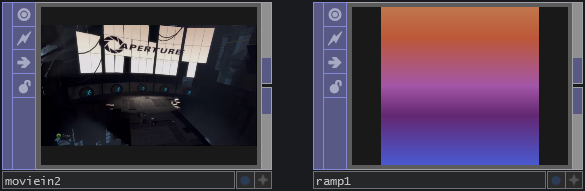

# TouchDesigner

- [TouchDesigner](#touchdesigner)
  - [Resources](#resources)
  - [Python cheatsheet](#python-cheatsheet)
  - [Shortcuts](#shortcuts)
  - [Noise](#noise)
  - [Operators](#operators)
    - [Generators](#generators)
    - [Filters](#filters)
    - [Texture operators(TOP)](#texture-operatorstop)
    - [Channel operators(CHOP)](#channel-operatorschop)
    - [Surface operators(SOP)](#surface-operatorssop)
    - [Materials(MAT)](#materialsmat)
    - [Data operators(DAT)](#data-operatorsdat)
  - [Components(COMP)](#componentscomp)
  - [Wires](#wires)
  - [Links](#links)

## Resources

- [SimonAA - Looping Noise in TouchDesigner](https://www.simonaa.media/tutorials/looping-noise-part-1)
- [SimonAA - Noise Displacement in TouchDesigner](https://www.simonaa.media/tutorials/noisedisplacement)
- [SimonAA - Tutorials & Articles](https://www.simonaa.media/tutorials-articles)
- [TouchDesigner Workshop Resources](https://github.com/kratadata/TD-Workshop)
- [TouchDesigner - Fundamentals](https://learn.derivative.ca/courses/100-fundamentals/)

## Python cheatsheet

> See: [Python cheatsheet](pythoncheatsheet)

## Shortcuts

| Shortcut                                       | Command                                    |
| ---------------------------------------------- | ------------------------------------------ |
| **double click** or **Tab**(when in a network) | Open **OP Dreate Dialog**                  |
| **Tab**(when in a dialog)                      | Navigate tabs                              |
| **X**                                          | Show/Hide links                            |
| **CMD** + B                                    | Show/Hide Pallette                         |
| U                                              | Go up a level                              |
| I                                              | Go into                                    |
| H                                              | See entire network                         |
| **Middle mouse click**                         | View info of operator                      |
| A                                              | Toggle viewer active for selected operator |
| C                                              | Setting color for operator                 |

## Noise

[Noise](../noise) is easily generated in TouchDesigner through the native noise operators (Noise TOP, Noise CHOP and Noise SOP). For more variation beyond the noise types found in the Noise TOP check out the noise component found in the generators section of the palette.

> Examples: TouchDesigner [Generative Design Examples](https://www.derivative.ca/wiki088/index.php?title=Generative_Design) (specifically M.1. Randomness and Noise).

## [Operators](https://derivative.ca/UserGuide/Operator)

Operators are nodes in TouchDesigner networks. They output data to other operators and have parameters and flags. Every operator has a Viewer Active flag (this looks like the + symbol). When an operator is Viewer Active it allows for additional manipulation when clicking in the operator’s viewer.

### [Generators](https://derivative.ca/UserGuide/Generator)

Operators that do not need any inputs connected (to create a meaningful output) are called Generators in TouchDesigner. They are darker shaded in the OP Create Dialog.

### [Filters](https://derivative.ca/UserGuide/Filter)

Operators that need 1 or more inputs (to create a meaningful output) are called Filters in TouchDesigner. They are lighter shaded in the OP Create Dialog.

### [Texture operators(TOP)](https://docs.derivative.ca/TOP)

Texture operators are used for images and pixel data. They provide real-time compositing and image manipulation. It can be used for textures, images, movies, control panel elements and more. 

### [Channel operators(CHOP)](https://docs.derivative.ca/CHOP)

Channel operators enable the processing of motion, audio, math, logic, MIDI data, numeric info and data streamed from/to devices and protocols. They operate on channels which is a sequence of numbers.

### [Surface operators(SOP)](https://docs.derivative.ca/SOP)

Surface operator generate, import, modify and combine 3D surfaces(geometry).

### [Materials(MAT)](https://docs.derivative.ca/MAT)

Materials apply a Shader to surface operators or 3D geometry.

### [Data operators(DAT)](https://docs.derivative.ca/DAT)

Data operators hold data(strings, scrips, XML). They can either be a table or lines of texts.

## [Components(COMP)](https://docs.derivative.ca/Component)

Components contain their own networks and are therefore reusable networks. They have top and bottom connectors for hierarchical organization.

## [Wires](https://docs.derivative.ca/Wire)

Wires can only be connected between operators of the same family and have the same color as their respective families. Wires can be static or animated. An animated wire in your network is a visual hint that there is a flow of data that is actively cooking between operators. This is very helpful, visually, for knowing at a glance what data is being updated (cooked) in your project. 

## [Links](https://docs.derivative.ca/Link)

Links can be used to connect operators of the same or different family (like with Select OPs), and are also seen when data is converted between families. Links appear as dotted lines in the network and can be hidden or exposed by the hotkey ‘x’. Links share the same characteristics of animation as wires – animated links are a visual cue that there is a flow of information that is actively being evaluated (cooking) in your network. 