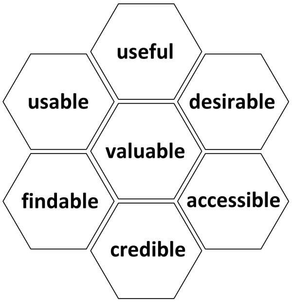

# User experience
- [User experience](#user-experience)
  - [Resources](#resources)
  - [What is User Experience](#what-is-user-experience)
    - [Definition characterized by Donald Norman](#definition-characterized-by-donald-norman)
    - [Definition characterized by ISO 9241-210](#definition-characterized-by-iso-9241-210)
    - [Definition characterized by Peter Dobr](#definition-characterized-by-peter-dobr)
    - [Definition by Peter Morville](#definition-by-peter-morville)
    - [The UX pyramid by Patrick W. Jordan](#the-ux-pyramid-by-patrick-w-jordan)
    - [Critics about UX](#critics-about-ux)
  - [Usability](#usability)
    - [Usability in context](#usability-in-context)
    - [Economic advantages of usability](#economic-advantages-of-usability)
    - [The five E's according to Whitney Quesenbery](#the-five-es-according-to-whitney-quesenbery)
    - [Effectiveness](#effectiveness)
    - [Efficiency](#efficiency)
    - [Satisfaction](#satisfaction)

## Resources
- [freecodecamp.org - What's the difference between UX and UI design](https://www.freecodecamp.org/news/whats-the-difference-between-ux-and-ui-design-2ca8d107de14/)

## What is User Experience
Holistic view of interaction between user and system is user experience.

Describes all aspects of a user's experience when interacting with a product, service, environment or facility
- Goes beyond pure user-friendliness
- Goes beyond media discontinuities

Includes soft factors such as emotions

> Beauty and brains, pleasure and usability —
they should go hand in hand - Donald Norman, 2003

### Definition characterized by Donald Norman
The experience in terms of functional aspects and the emotional needs of the user.

### Definition characterized by ISO 9241-210
Perceptions and reactions of a person resulting from the actual and/or expected use of a product, system or service. User experience encompasses all emotions, preferences, perceptions, physiological and psychological, behaviors and performances that occur before, during and after use."

### Definition characterized by Peter Dobr

- Look: credibility, trust, harmony, mood
- Feel: "joy of use", interaction, reaction
- Usability: functionality, intuitivity, predictability

### Definition by Peter Morville

Product/Website/App/Service should be:
- Useful: should be original and fulfill a need
- Usable: must be easy to use
- Desirable: image, identity, brand, and other design elements are used to evoke emotion and appreciation
- Findable: needs to be navigable and locatable onsite
- Accessible: needs to be accessible to people with disabilities
- Credible: Users must trust and believe what you tell them
- Valuable: should create value for the stakeholder and should be valuable to the user

### The UX pyramid by Patrick W. Jordan

- Bottom level: Useful - The offered service and product features provide value to the user while supporting his basic needs.
- Middle level: Usable - The user is able to use the product easily. Effectiveness, Efficiency, Learnability, Error tolerent, Memorability
- Top level: Joy of Use, Beautiful, Aesthetic, Emotional

### Critics about UX

- We can't design the experience, everyone experiences differently.
- User Experience is not measurable

## Usability

> The main question for usability is: What do users want to achieve with our service/product?

Usability is defined as the extent to which a user can use a specific product in a specific environment to efficiently accomplish his task.

Usability stands for the usability or user-friendliness of an interactive system. Interactive systems are systems that have a user interface and respond to user actions. These include simple machines as well as complex software systems. The term usability means that a system:
- is easy to learn
- has a low error rate (effective)
- is efficient to use
- satisfies the user

Usability applies to ever system that requires interaction.

### Usability in context
Utility - erfüllt das System mit seinen Funktionen die Bedürfnisse?
+
Usability - können die Benutzer das System erfolgreich benützen?
+
Likeability - haben die Benutzer das Gefühl, das System sei angemessen?
+
Accessibility - Ist das System auch für Behinderte zugänglich?
muss im Gleichgewicht stehen mit den Faktoren
Cost - was sind die Investitions- und laufenden Kosten?
- was sind die sozialen und organisatorischen Konsequenzen?
um eine Entscheidung zu treffen über die
Acceptability - wie ist die bestmögliche Anschaffung zu tätigen?

### Economic advantages of usability
- Support- und Servicekosten reduzieren
- Schulungskosten reduzieren
- Reduktion von Kosten und Aufwand
- Vermeidung teurer Verzögerungen in der Produktentwicklung durch Vor-Markt-Tests
- Einfachere Dokumentation und Schulung
- bessere marketing-wirksame Produktbeschreibung der Leistung, da bereits verlässlich getestet
- Absatz von Produkten erhöhen
- Verkauf anderer Produkte
- Reputation eines Unternehmens verbessern
> Faktor 10: CHF 1 in Usability investiert, ergibt
ein Rückfluss von CHF 10

### The five E's according to Whitney Quesenbery

- Effective: How completely and accurately the work or experience is completed or goals reached
- Efficient: How quickly this work can be completed
- Engaging: How well the interface draws the user into the interaction and how pleasant and satisfying it is to use
- Error Tolerant: How well the product prevents errors and can help the user recover from mistakes that do occur
- Easy to Learn: How well the product supports both the initial orientation and continued learning throughout the complete lifetime of use

### Effectiveness
Die Genauigkeit und Vollständigkeit, mit der Benutzer ein bestimmtes Arbeitsergebnis erreichen.

### Efficiency
Der im Verhältnis zur Genauigkeit und Vollständigkeit eingesetzte Aufwand, mit dem Benutzer ein bestimmtes Ziel erreichen.

### Satisfaction
Beeinträchtigungsfreiheit und Akzeptanz der Nutzung